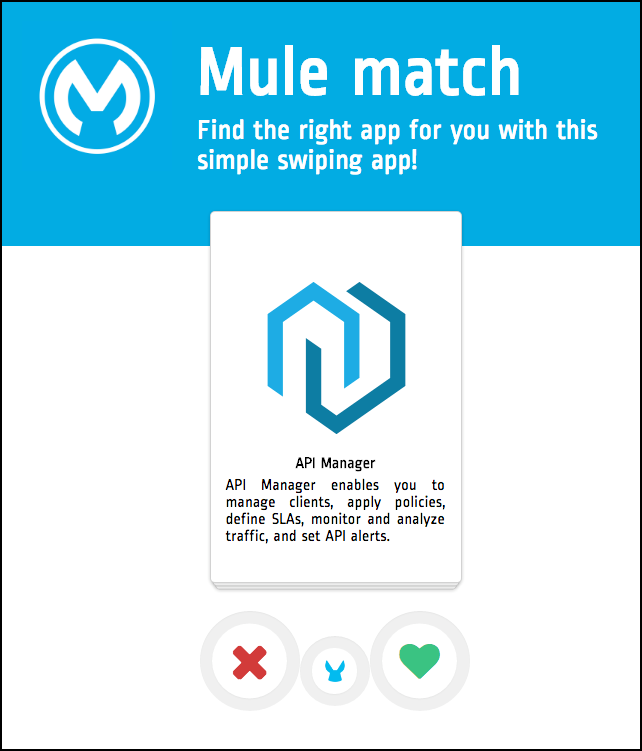

# Mule Match

A simple swapping app to use as a Reference app for React applications.



This app is built using the following tools:

* React
* Redux
* Webpack
* Babel
* Mocha & Enzyme for testing

### Getting Started

Run the following commands:

```
npm install
npm start # Start the development server on port 9999

```

### Testing

Tests are written using Mocha and [Enzyme from Airbnb] (https://github.com/airbnb/enzyme). You can run all of them with the following commands:

```
npm test
```
